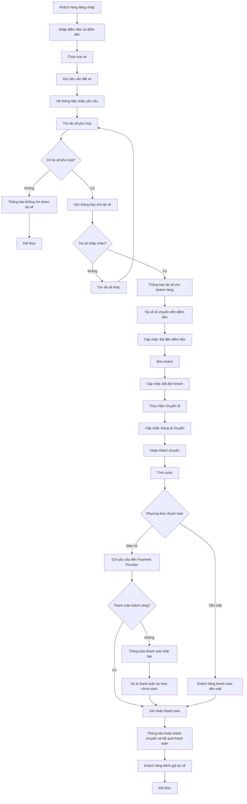
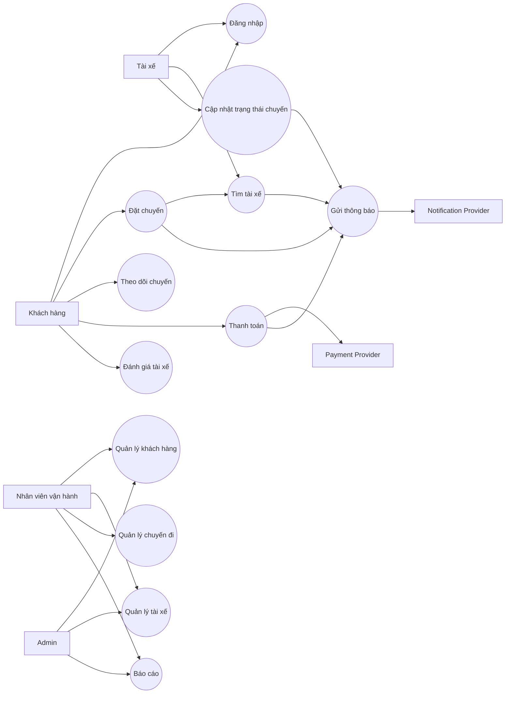

# B1. Đọc và phân tích – Business Context & Business Problem

## 1. Business Context – Bối cảnh nghiệp vụ

**Công ty ABC** cung cấp dịch vụ **đặt xe trực tuyến**.

Hiện tại khách hàng có thể đặt xe bằng:
- Gọi **tổng đài**
- Sử dụng **ứng dụng đơn giản**

Tuy nhiên, hệ thống hiện tại còn nhiều hạn chế và không phù hợp khi doanh nghiệp muốn mở rộng quy mô.

---

## 2. Business Problem – Vấn đề kinh doanh

### Hệ thống hiện tại đang gặp vấn đề gì?

| Vấn đề hiện tại | Ảnh hưởng |
|---|---|
| Phân công tài xế chủ yếu thủ công | Mất thời gian, tốn nhân lực |
| Khó tìm tài xế phù hợp | Khách hàng có thể phải chờ lâu |
| Tài xế từ chối nhưng chưa có cơ chế tự động tìm người khác | Khách có thể phải đặt lại |
| Khách hàng khó theo dõi trạng thái chuyến | Trải nghiệm khách hàng kém |
| Thông tin thanh toán chưa tập trung | Khó quản lý và tra cứu |
| Thông báo chưa linh hoạt | Khó cập nhật trạng thái kịp thời |
| Nhân viên vận hành khó quản lý | Khó theo dõi chuyến, tài xế và sự cố |
| Hệ thống khó mở rộng | Không phù hợp khi số lượng user/chuyến tăng |
| Các thành phần phụ thuộc lẫn nhau | Một lỗi có thể ảnh hưởng toàn hệ thống |
| Khó tích hợp dịch vụ mới | Khó phát triển trong tương lai |

### Vấn đề cốt lõi

> Hệ thống cũ phù hợp với việc **đặt xe cơ bản**, nhưng không đáp ứng được yêu cầu về **tự động hóa, quản lý, khả năng mở rộng và phát triển lâu dài** của doanh nghiệp.

---

## 3. KH muốn giải quyết vấn đề gì?

Khách hàng muốn xây dựng một **CAB System mới** nhằm:

1. **Tự động hóa quy trình đặt và phân công xe**
2. **Giúp khách hàng theo dõi chuyến đi rõ ràng**
3. **Quản lý thanh toán tập trung**
4. **Hỗ trợ nhân viên vận hành quản lý toàn bộ hoạt động**
5. **Phục vụ số lượng lớn khách hàng và tài xế**
6. **Đảm bảo hệ thống ổn định và bảo mật**
7. **Có khả năng mở rộng và phát triển thêm tính năng trong tương lai**

---

## 4. Tại sao hệ thống hiện tại không đáp ứng?

Hệ thống cũ chủ yếu đáp ứng nhu cầu **đặt xe cơ bản**, nhưng chưa đáp ứng được yêu cầu về **tự động hóa, quản lý và mở rộng**.

### Các hạn chế chính:

- Phân công tài xế còn **thủ công**
- Chưa hỗ trợ tốt việc **tìm tài xế gần và phù hợp**
- Chưa có cơ chế **tự động tìm tài xế khác khi tài xế từ chối**
- Khách hàng **khó theo dõi chuyến**
- Thanh toán **chưa được quản lý tập trung**
- Nhân viên vận hành **khó kiểm soát hoạt động**
- Hệ thống **khó mở rộng khi tải tăng**
- Khó thêm **dịch vụ, phương thức thanh toán và kênh thông báo**
- Một lỗi ở một chức năng có thể **ảnh hưởng đến toàn bộ hệ thống**

---

# 5. Mục tiêu kinh doanh – Business Goals

## 5.1. Tự động hóa

Tự động hóa toàn bộ quy trình:

> Đặt xe → Tìm tài xế → Phân công → Thực hiện chuyến → Tính cước → Thanh toán → Đánh giá

## 5.2. Nâng cao trải nghiệm khách hàng

Khách hàng có thể:

- Biết yêu cầu đã được tiếp nhận
- Biết hệ thống đang tìm tài xế
- Biết tài xế nào nhận chuyến
- Theo dõi trạng thái chuyến
- Biết thời gian dự kiến tài xế đến
- Xem cước phí
- Thanh toán
- Xem lịch sử chuyến
- Đánh giá tài xế

## 5.3. Tăng hiệu quả vận hành

Nhân viên vận hành có thể:

- Quản lý khách hàng
- Quản lý tài xế
- Quản lý phương tiện
- Theo dõi chuyến
- Xử lý chuyến lỗi
- Tra cứu giao dịch
- Xem báo cáo

## 5.4. Tăng khả năng mở rộng

Hệ thống có thể mở rộng:

- Số lượng khách hàng
- Số lượng tài xế
- Số lượng chuyến
- Loại dịch vụ
- Phương thức thanh toán
- Kênh thông báo
- Nhà cung cấp bên thứ ba

## 5.5. Đảm bảo an toàn và ổn định

- Xác thực người dùng
- Phân quyền nhân viên
- Bảo vệ dữ liệu cá nhân
- Bảo vệ dữ liệu vị trí
- Bảo vệ dữ liệu giao dịch
- Lưu vết các thao tác quan trọng
- Một chức năng bị lỗi không làm toàn bộ hệ thống ngừng hoạt động

---

# 6. Ai sử dụng hệ thống?

| Actor | Vai trò / Nhu cầu |
|---|---|
| **Khách hàng (KH)** | Đăng ký, đăng nhập, đặt xe, theo dõi chuyến, thanh toán, đánh giá |
| **Tài xế (TX)** | Quản lý hồ sơ, nhận/từ chối chuyến, cập nhật trạng thái và vị trí |
| **Nhân viên vận hành (NHVH)** | Quản lý KH, TX, phương tiện, chuyến đi, giao dịch và sự cố |
| **Nhà cung cấp thanh toán** | Xử lý thanh toán điện tử |
| **Nhà cung cấp thông báo** | Gửi thông báo và có thể mở rộng thêm trong tương lai |

---

# 7. Giá trị hệ thống mới so với hệ thống cũ

| Khía cạnh | Hệ thống cũ | Hệ thống CAB mới |
|---|---|---|
| Đặt xe | Có | Có |
| Tìm tài xế | Chủ yếu thủ công | Tự động |
| Phân công tài xế | Thủ công | Tự động theo tiêu chí |
| Tài xế từ chối | Xử lý hạn chế | Tự động tìm tài xế khác |
| Theo dõi chuyến | Hạn chế | Theo dõi trạng thái rõ ràng |
| Vị trí tài xế | Chưa đáp ứng tốt | Lưu và sử dụng để tìm tài xế |
| Thanh toán | Chưa tập trung | Quản lý tập trung + tích hợp payment |
| Thông báo | Hạn chế | Thông báo theo từng sự kiện |
| Quản trị | Hạn chế | Có hệ thống quản trị |
| Báo cáo | Hạn chế | Có báo cáo vận hành |
| Phân quyền | Chưa đầy đủ | Có kiểm soát quyền |
| Mở rộng | Khó | Có khả năng mở rộng |
| Tích hợp | Khó | Dễ thêm provider/dịch vụ |
| Khả năng chịu tải | Hạn chế | Có khả năng phục vụ lượng lớn |
| Xử lý lỗi | Có thể ảnh hưởng hệ thống | Các thành phần có khả năng hoạt động độc lập |

---

# 8. Giá trị tạo ra cho từng nhóm người dùng

## 8.1. Khách hàng

**Giá trị:**
- Đặt xe thuận tiện hơn
- Biết rõ trạng thái chuyến
- Biết tài xế đã nhận chuyến
- Theo dõi thời gian dự kiến tài xế đến
- Thanh toán dễ dàng
- Xem lịch sử và đánh giá tài xế

### Quy trình

> Đặt xe → Biết đang tìm tài xế → Biết tài xế → Theo dõi chuyến → Thanh toán → Đánh giá

---

## 8.2. Tài xế

**Giá trị:**
- Nhận được thông báo chuyến phù hợp
- Có thể chấp nhận hoặc từ chối chuyến
- Chủ động cập nhật trạng thái
- Hệ thống sử dụng vị trí để hỗ trợ tìm chuyến phù hợp
- Quản lý chuyến thuận tiện hơn

---

## 8.3. Nhân viên vận hành

**Giá trị:**
- Quản lý tập trung
- Theo dõi chuyến đang diễn ra
- Kiểm tra trạng thái tài xế
- Xử lý các chuyến bị lỗi
- Tra cứu giao dịch
- Xem báo cáo
- Giảm thao tác thủ công

---

## 8.4. Doanh nghiệp

**Giá trị:**
- Tăng khả năng phục vụ khách hàng
- Giảm chi phí và công việc thủ công
- Tăng hiệu quả vận hành
- Quản lý dữ liệu tập trung
- Có khả năng mở rộng hệ thống
- Dễ phát triển tính năng mới
- Hỗ trợ doanh nghiệp phát triển lâu dài

---

# 9. Business Goal → Business Value

```text
HỆ THỐNG CŨ
    ↓
Phân công tài xế thủ công
Khó theo dõi chuyến
Thanh toán chưa tập trung
Khó quản lý
Khó mở rộng
    ↓
BUSINESS PROBLEM
    ↓
XÂY DỰNG CAB SYSTEM MỚI
    ↓
Tự động hóa
Theo dõi chuyến
Quản lý thanh toán
Quản lý vận hành
Bảo mật
Khả năng mở rộng
    ↓
BUSINESS VALUE
    ↓
Trải nghiệm khách hàng tốt hơn
Vận hành hiệu quả hơn
Phục vụ được nhiều người dùng hơn
Dễ phát triển tính năng mới
Dễ tích hợp hệ thống bên ngoài
Hỗ trợ doanh nghiệp phát triển lâu dài

```
# B2. Xác định Stakeholder

## 1. Danh sách Stakeholder

| Stakeholder nào | Vai trò |
|---|---|
| **Ban giám đốc / Chủ doanh nghiệp** | Đưa ra mục tiêu kinh doanh, phê duyệt phạm vi và định hướng phát triển hệ thống |
| **Khách hàng (Customer)** | Đăng ký, đặt xe, theo dõi chuyến, thanh toán và đánh giá tài xế |
| **Tài xế (Driver)** | Nhận và thực hiện chuyến, cập nhật trạng thái chuyến và vị trí |
| **Nhân viên vận hành (Operator)** | Quản lý khách hàng, tài xế, phương tiện, chuyến đi; theo dõi và xử lý sự cố |
| **Quản trị viên hệ thống (Admin)** | Quản lý tài khoản, phân quyền và các thao tác quản trị nhạy cảm |
| **Nhà cung cấp thanh toán (Payment Provider)** | Xử lý các giao dịch thanh toán điện tử |
| **Nhà cung cấp dịch vụ thông báo (Notification Provider)** | Gửi thông báo đến khách hàng và tài xế |
| **Business Analyst (BA)** | Thu thập, phân tích và làm rõ yêu cầu; xác định quy trình nghiệp vụ và các vấn đề chưa rõ |
| **Đội phát triển hệ thống (Development Team)** | Thiết kế, xây dựng, tích hợp và triển khai hệ thống |
| **Đội vận hành kỹ thuật / IT** | Giám sát hệ thống, đảm bảo tính ổn định, hiệu năng, bảo mật và khả năng mở rộng |

---

# 2. Mức độ ảnh hưởng của Stakeholder

Đánh giá theo 2 tiêu chí:

- **Mức độ ảnh hưởng (Power/Influence):** Khả năng quyết định hoặc tác động đến dự án.
- **Mức độ quan tâm (Interest):** Mức độ stakeholder quan tâm và sử dụng kết quả của hệ thống.

| Stakeholder | Ảnh hưởng | Quan tâm | Mức độ |
|---|---|---|---|
| **Ban giám đốc** | 🔴 Cao | 🔴 Cao | Rất cao |
| **Nhân viên vận hành** | 🔴 Cao | 🔴 Cao | Rất cao |
| **Admin** | 🔴 Cao | 🔴 Cao | Rất cao |
| **BA** | 🔴 Cao | 🔴 Cao | Rất cao |
| **IT / Technical Operation** | 🔴 Cao | 🔴 Cao | Rất cao |
| **Khách hàng** | 🟡 Trung bình | 🔴 Cao | Cao |
| **Tài xế** | 🟡 Trung bình | 🔴 Cao | Cao |
| **Development Team** | 🟡 Trung bình | 🔴 Cao | Cao |
| **Payment Provider** | 🟡 Trung bình | 🟡 Trung bình | Trung bình |
| **Notification Provider** | 🟢 Thấp | 🟡 Trung bình | Thấp – Trung bình |

---


## 3. Ma trận Stakeholder


```text
                         MỨC ĐỘ QUAN TÂM
                    Thấp                  Cao
                 ┌─────────────────┬─────────────────────┐
                 │                 │                     │
      CAO        │  GIỮ HÀI LÒNG   │  QUẢN LÝ CHẶT CHẼ   │
                 │                 │                     │
                 │ - Nhà cung cấp  │ - Ban giám đốc      │
                 │   thanh toán    │ - Nhân viên vận hành│
                 │ - Nhà cung cấp  │ - BA                │
                 │   thông báo     │ - Đội phát triển    │
                 │                 │ - IT                │
                 ├─────────────────┼─────────────────────┤
                 │                 │                     │
      THẤP       │    THEO DÕI     │    GIỮ THÔNG TIN    │
                 │                 │                     │
                 │ - Bên hỗ trợ    │ - Khách hàng        │
                 │   gián tiếp     │ - Tài xế            │
                 │                 │                     │
                 └─────────────────┴─────────────────────┘

                         MỨC ĐỘ ẢNH HƯỞNG

```


# B3. Xác định Business Role

| Mã | Mục đích của nghiệp vụ | Business Role |
|---|---|---|
| **BC-01** | **Tăng hiệu quả thanh toán** | Cho phép hệ thống tự động tính cước, hỗ trợ thanh toán tiền mặt/thanh toán điện tử và xử lý kết quả giao dịch |
| **BC-02** | **Giảm thời gian tìm tài xế** | Cho phép hệ thống tự động tìm và ưu tiên tài xế phù hợp, gần khách hàng |
| **BC-03** | **Nâng cao trải nghiệm khách hàng** | Cho phép khách hàng đặt xe, theo dõi trạng thái chuyến, nhận thông báo và đánh giá tài xế |
| **BC-04** | **Tăng hiệu quả vận hành** | Cho phép nhân viên vận hành quản lý khách hàng, tài xế, phương tiện và chuyến đi trên một hệ thống |
| **BC-05** | **Giảm thời gian xử lý khi tài xế từ chối chuyến** | Cho phép hệ thống tự động tìm tài xế khác khi tài xế được đề xuất không phản hồi hoặc từ chối |
| **BC-06** | **Cải thiện khả năng theo dõi chuyến đi** | Cho phép hệ thống cập nhật và hiển thị trạng thái chuyến từ lúc đặt xe đến khi hoàn thành |
| **BC-07** | **Nâng cao khả năng quản lý doanh thu** | Cho phép hệ thống lưu trữ và tra cứu thông tin cước phí, thanh toán và lịch sử giao dịch |
| **BC-08** | **Tăng hiệu quả thông báo** | Cho phép hệ thống gửi thông báo đến khách hàng và tài xế theo từng sự kiện của chuyến đi |
| **BC-09** | **Tăng khả năng kiểm soát và bảo mật** | Cho phép xác thực người dùng, phân quyền thao tác và lưu vết các hoạt động quan trọng |
| **BC-10** | **Hỗ trợ ra quyết định kinh doanh** | Cho phép ban lãnh đạo theo dõi báo cáo về số chuyến, doanh thu, tỷ lệ hoàn thành, tỷ lệ hủy và hiệu quả tài xế |
| **BC-11** | **Tăng khả năng mở rộng hệ thống** | Cho phép hệ thống mở rộng số lượng khách hàng, tài xế và chuyến đi mà không ảnh hưởng đến các chức năng đang hoạt động |
| **BC-12** | **Hỗ trợ phát triển dịch vụ trong tương lai** | Cho phép dễ dàng bổ sung loại dịch vụ, phương thức thanh toán, nhà cung cấp thanh toán và kênh thông báo mới |

---

# B4. Phạm vi dự án – Minimal Valuable Project (MVP)

## 1. Mục tiêu

Xác định **phạm vi tối thiểu nhưng có giá trị** để hệ thống CAB có thể vận hành được các nghiệp vụ cốt lõi trong giai đoạn đầu.

---

## 2. Phạm vi 

### 2.1. Quản lý khách hàng

Hệ thống cho phép:

- Đăng ký tài khoản khách hàng
- Đăng nhập
- Cập nhật thông tin cá nhân
- Quản lý thông tin khách hàng
- Xem trạng thái tài khoản

**Giá trị mang lại:**

> Có dữ liệu khách hàng để phục vụ quy trình đặt xe và quản lý người dùng.

---

### 2.2. Quản lý tài xế

Hệ thống cho phép:

- Đăng ký tài khoản tài xế hoặc nhân viên vận hành tạo tài khoản
- Đăng nhập
- Cập nhật thông tin cá nhân
- Quản lý thông tin phương tiện
- Cập nhật trạng thái hoạt động:
  - Sẵn sàng
  - Không sẵn sàng
- Quản lý thông tin tài xế trong hệ thống

**Giá trị mang lại:**

> Có dữ liệu tài xế và trạng thái hoạt động để phục vụ việc phân công chuyến.

---

# B5. Xác nhận với khách hàng và chuyển đổi thành Business Requirement

## 1. Business Requirement

| Mã | Tên | Diễn giải |
|---|---|---|
| **BR-01** | **Cho phép đặt chuyến** | Hệ thống cho phép khách hàng tạo yêu cầu đặt chuyến bằng cách xác định vị trí hiện tại, nhập/chọn điểm đón, điểm đến và lựa chọn loại xe phù hợp. |
| **BR-02** | **Tìm tài xế** | Hệ thống tự động tìm tài xế phù hợp với nhu cầu chuyến đi dựa trên vị trí, trạng thái sẵn sàng, loại xe và các tiêu chí vận hành đã được xác định. |
| **BR-03** | **Theo dõi chuyến đi** | Hệ thống cho phép khách hàng theo dõi chuyến đi trong suốt quá trình di chuyển và xem trạng thái hiện tại của chuyến. |
| **BR-04** | **Hỗ trợ thanh toán** | Hệ thống cho phép khách hàng thanh toán tiền mặt hoặc thanh toán điện tử/chuyển khoản sau khi chuyến đi hoàn thành. |
| **BR-05** | **Quản lý khách hàng** | Hệ thống cho phép khách hàng đăng ký, đăng nhập, cập nhật thông tin cá nhân và quản lý tài khoản. |
| **BR-06** | **Quản lý tài xế** | Hệ thống cho phép tài xế đăng ký hoặc được nhân viên vận hành tạo tài khoản, cập nhật thông tin cá nhân, phương tiện và trạng thái hoạt động. |
| **BR-07** | **Xử lý tài xế từ chối chuyến** | Khi tài xế không phản hồi hoặc từ chối chuyến, hệ thống tự động tiếp tục tìm tài xế phù hợp khác mà không yêu cầu khách hàng tạo lại yêu cầu. |
| **BR-08** | **Thông báo trạng thái chuyến** | Hệ thống gửi thông báo cho khách hàng và tài xế khi có các sự kiện quan trọng như tiếp nhận yêu cầu, tài xế nhận chuyến, tài xế đến điểm đón, hoàn thành chuyến và kết quả thanh toán. |
| **BR-09** | **Tính cước chuyến đi** | Hệ thống xác định số tiền khách hàng phải trả dựa trên loại dịch vụ và thông tin của chuyến đi. |
| **BR-10** | **Quản lý vận hành** | Hệ thống cho phép nhân viên vận hành quản lý khách hàng, tài xế, phương tiện và chuyến đi; đồng thời theo dõi và xử lý các trường hợp chuyến bị lỗi. |
| **BR-11** | **Quản lý lịch sử** | Hệ thống cho phép khách hàng xem lịch sử chuyến đi, số tiền đã thanh toán và cho phép nhân viên tra cứu lịch sử giao dịch. |
| **BR-12** | **Đánh giá tài xế** | Sau khi chuyến đi hoàn thành, hệ thống cho phép khách hàng đánh giá tài xế. |
| **BR-13** | **Phân quyền và bảo mật** | Hệ thống yêu cầu xác thực người dùng, kiểm soát quyền truy cập của nhân viên và bảo vệ thông tin cá nhân, phương tiện, vị trí và giao dịch. |
| **BR-14** | **Báo cáo hoạt động** | Hệ thống cung cấp báo cáo về số lượng chuyến, doanh thu, tỷ lệ hoàn thành, tỷ lệ hủy và hiệu quả hoạt động của tài xế. |
| **BR-15** | **Khả năng mở rộng** | Hệ thống cho phép mở rộng thêm loại dịch vụ, phương thức thanh toán, nhà cung cấp thanh toán và kênh thông báo mà không phải xây dựng lại toàn bộ hệ thống. |

# B6. Business Process – Quy trình nghiệp vụ đặt xe CAB System

## 1. Business Process tổng thể


# B7. Phân rã yêu cầu chức năng

## Chức năng: Tìm tài xế

| Mã | Tên | Diễn giải |
|---|---|---|
| **FR-01** | Xác định vị trí khách hàng | Hệ thống xác định vị trí/điểm đón của khách hàng. |
| **FR-02** | Tìm tài xế sẵn có | Hệ thống tìm các tài xế đang sẵn sàng nhận chuyến. |
| **FR-03** | Lọc theo loại xe | Hệ thống lọc tài xế theo loại xe khách hàng lựa chọn. |
| **FR-04** | Tính khoảng cách | Hệ thống tính khoảng cách từ tài xế đến điểm đón để chọn tài xế phù hợp. |
| **FR-05** | Xử lý từ chối | Nếu tài xế từ chối hoặc không phản hồi, hệ thống tiếp tục tìm tài xế khác. |

## Chức năng: Đặt và theo dõi chuyến

| Mã | Tên | Diễn giải |
|---|---|---|
| **FR-06** | Đặt chuyến | Khách hàng nhập điểm đón, điểm đến, chọn loại xe và gửi yêu cầu đặt xe. |
| **FR-07** | Theo dõi chuyến | Khách hàng theo dõi trạng thái chuyến trong quá trình di chuyển. |

## Chức năng: Thanh toán

| Mã | Tên | Diễn giải |
|---|---|---|
| **FR-08** | Tính cước | Hệ thống tính số tiền khách hàng cần thanh toán sau khi hoàn thành chuyến. |
| **FR-09** | Thanh toán | Hệ thống hỗ trợ thanh toán tiền mặt và thanh toán điện tử. |

## Chức năng: Quản lý người dùng

| Mã | Tên | Diễn giải |
|---|---|---|
| **FR-10** | Quản lý khách hàng | Khách hàng đăng ký, đăng nhập và cập nhật thông tin cá nhân. |
| **FR-11** | Quản lý tài xế | Quản lý thông tin tài xế, phương tiện và trạng thái sẵn sàng nhận chuyến. |

> **MVP tập trung vào 11 yêu cầu chức năng cốt lõi trên. Không sử dụng AI để tìm đường đi ngắn nhất.**


# B8. Quy tắc nghiệp vụ và ngoại lệ

## 1. Business Rule

| Mã | Business Rule | Quy tắc |
|---|---|---|
| **BR-01** | Tìm tài xế | Hệ thống chỉ tìm các tài xế đang **sẵn sàng nhận chuyến** và phù hợp với loại xe khách hàng chọn. |
| **BR-02** | Không có tài xế | Nếu không tìm được tài xế phù hợp, hệ thống phải **thông báo cho khách hàng** và kết thúc yêu cầu đặt xe. |
| **BR-03** | Tài xế từ chối | Nếu tài xế từ chối hoặc không phản hồi trong thời gian quy định, hệ thống phải **tiếp tục tìm tài xế khác**. |
| **BR-04** | Tính cước | Sau khi chuyến hoàn thành, hệ thống phải **tính số tiền khách hàng cần thanh toán** theo loại dịch vụ và thông tin chuyến đi. |
| **BR-05** | Thanh toán thất bại | Nếu thanh toán điện tử thất bại, hệ thống phải **thông báo cho khách hàng** và cho phép thực hiện thanh toán lại theo chính sách. |
| **BR-06** | Cập nhật trạng thái | Tài xế phải cập nhật trạng thái chuyến theo đúng trình tự: **đã đến → đã đón khách → đang di chuyển → hoàn thành**. |
| **BR-07** | Phân quyền | Chỉ nhân viên có quyền phù hợp mới được thực hiện các thao tác quản trị nhạy cảm. |
| **BR-08** | Bảo mật | Người dùng phải đăng nhập và xác thực trước khi sử dụng các chức năng yêu cầu tài khoản. |

---

## 2. Các trường hợp ngoại lệ

| Mã | Trường hợp ngoại lệ | Cách xử lý |
|---|---|---|
| **EX-01** | Không có tài xế phù hợp | Thông báo cho khách hàng rằng chưa tìm được tài xế và kết thúc yêu cầu. |
| **EX-02** | Tài xế từ chối chuyến | Hệ thống tự động tìm tài xế tiếp theo. |
| **EX-03** | Tài xế không phản hồi | Sau thời gian quy định, hệ thống chuyển sang tìm tài xế khác. |
| **EX-04** | Thanh toán điện tử thất bại | Thông báo lỗi và cho phép khách hàng thanh toán lại theo chính sách. |
| **EX-05** | Mất kết nối mạng | Hệ thống giữ trạng thái hiện tại và đồng bộ lại khi kết nối được khôi phục. |
| **EX-06** | Thông báo thất bại | Hệ thống không được làm dừng quy trình đặt xe; có thể ghi nhận lỗi và thực hiện gửi lại. |
| **EX-07** | Lỗi hệ thống thanh toán | Chỉ chức năng thanh toán bị ảnh hưởng, các chức năng đặt xe và theo dõi chuyến vẫn tiếp tục hoạt động. |

---

## 3. Quy tắc quan trọng nhất

> **Không có tài xế:** Thông báo khách hàng → kết thúc yêu cầu.

> **Tài xế từ chối/không phản hồi:** Tự động tìm tài xế khác → không yêu cầu khách hàng đặt lại.

> **Thanh toán thất bại:** Thông báo khách hàng → cho phép thanh toán lại → không làm dừng toàn bộ hệ thống.

> **Lỗi thông báo:** Ghi nhận lỗi và thử gửi lại → không làm ảnh hưởng đến quy trình đặt xe.

> **Mất kết nối:** Giữ trạng thái hiện tại → đồng bộ lại khi kết nối được khôi phục.


# B8. Quy tắc nghiệp vụ và ngoại lệ

## Business Rule

| Mã | Business Rule | Cách xử lý |
|---|---|---|
| **BR-01** | Không có tài xế | Thông báo cho khách hàng **không tìm được tài xế phù hợp** và kết thúc yêu cầu đặt xe. |
| **BR-02** | Tài xế từ chối/không phản hồi | Hệ thống **tự động tìm tài xế khác**, khách hàng không cần đặt lại. |
| **BR-03** | Thanh toán thất bại | Thông báo cho khách hàng và **cho phép thanh toán lại** theo chính sách của doanh nghiệp. |
| **BR-04** | Tài xế hoàn thành chuyến | Hệ thống chuyển trạng thái chuyến sang **Hoàn thành** và tiến hành tính cước. |
| **BR-05** | Người dùng chưa đăng nhập | Không cho phép sử dụng các chức năng yêu cầu tài khoản. |
| **BR-06** | Mất kết nối | Giữ lại trạng thái/dữ liệu cần thiết và đồng bộ lại khi kết nối được khôi phục. |

---

# B9. Mô hình hóa dữ liệu (Data Modeling)

## 1. Xác định các thực thể

### Khách hàng

```text
KhachHang(ID, Ten, SDT, Email, MatKhau, DiaChi)

TaiXe(ID, Ten, SDT, Email, MatKhau, TrangThai, ViTri)

ChuyenDi(ID, KhachHangID, TaiXeID, DiemDon, DiemDen, LoaiXe, TrangThai, ThoiGianDat, ThoiGianHoanThanh)

ThanhToan(ID, ChuyenDiID, SoTien, PhuongThuc, TrangThai, ThoiGianThanhToan)

DanhGia(ID, ChuyenDiID, KhachHangID, TaiXeID, SoSao, NhanXet)

ThongBao(ID, NguoiNhanID, ChuyenDiID, NoiDung, LoaiThongBao, TrangThai, ThoiGianGui)


KhachHang
    │
    │ 1 - N
    ▼
ChuyenDi
    │
    │ N - 1
    ▼
TaiXe
    │
    │ 1 - 1
    ▼
PhuongTien

ChuyenDi
    │
    │ 1 - 1
    ▼
ThanhToan

ChuyenDi
    │
    │ 1 - 1
    ▼
DanhGia

ChuyenDi
    │
    │ 1 - N
    ▼
ThongBao

```
# B10. Xác định Non-Functional Requirements

| Mã | Nhóm | Yêu cầu |
|---|---|---|
| **NFR-01** | **Hiệu năng** | Hệ thống phải đáp ứng tốt khi số lượng khách hàng và tài xế tăng cao, đặc biệt vào giờ cao điểm. |
| **NFR-02** | **Khả năng mở rộng** | Có thể mở rộng độc lập các thành phần khi tải tăng mà không ảnh hưởng toàn bộ hệ thống. |
| **NFR-03** | **Tính sẵn sàng** | Lỗi ở thanh toán hoặc thông báo không được làm toàn bộ hệ thống đặt xe ngừng hoạt động. |
| **NFR-04** | **Bảo mật** | Người dùng phải được xác thực và các chức năng quản trị phải được phân quyền. |
| **NFR-05** | **Bảo vệ dữ liệu** | Thông tin cá nhân, phương tiện, vị trí và giao dịch phải được bảo vệ. |
| **NFR-06** | **Khả năng bảo trì** | Cho phép thêm chức năng mới hoặc thay đổi một thành phần mà hạn chế ảnh hưởng đến các chức năng khác. |
| **NFR-07** | **Audit / Logging** | Hệ thống phải lưu vết các thao tác quan trọng để phục vụ kiểm tra và xử lý sự cố. |
| **NFR-08** | **Tích hợp** | Có khả năng tích hợp với nhà cung cấp thanh toán và các kênh thông báo bên ngoài. |

---

# B11. Vẽ Use Case và đặc tả Use Case

## 1. Use Case Diagram


# B12. Acceptance Criteria – Tiêu chí nghiệm thu

## 1. Mục đích

Acceptance Criteria là **tập hợp các điều kiện/quy tắc** dùng để xác nhận hệ thống đã đáp ứng yêu cầu của khách hàng.

> Dự án được xem là **hoàn thành và có thể nghiệm thu** khi các chức năng quan trọng hoạt động đúng và đáp ứng các tiêu chí đã thống nhất.

---

## 2. Acceptance Criteria của CAB System

| Mã | Chức năng | Tiêu chí nghiệm thu |
|---|---|---|
| **AC-01** | Đăng nhập | Người dùng nhập đúng tài khoản/mật khẩu thì đăng nhập thành công; sai thông tin thì hệ thống thông báo lỗi. |
| **AC-02** | Đặt chuyến | Khách hàng nhập được điểm đón, điểm đến, chọn loại xe và tạo được yêu cầu đặt chuyến. |
| **AC-03** | Tìm tài xế | Hệ thống tìm được tài xế đang sẵn sàng và phù hợp với loại xe khách hàng yêu cầu. |
| **AC-04** | Không có tài xế | Nếu không có tài xế phù hợp, hệ thống phải thông báo rõ ràng cho khách hàng. |
| **AC-05** | Tài xế từ chối | Khi tài xế từ chối/không phản hồi, hệ thống phải tiếp tục tìm tài xế khác mà khách hàng không cần đặt lại. |
| **AC-06** | Theo dõi chuyến | Khách hàng xem được trạng thái chuyến: đã nhận chuyến, tài xế đến, đã đón khách, đang di chuyển và hoàn thành. |
| **AC-07** | Thanh toán | Khách hàng có thể thanh toán bằng tiền mặt hoặc phương thức điện tử. |
| **AC-08** | Thanh toán thất bại | Khi thanh toán điện tử thất bại, hệ thống thông báo lỗi và cho phép xử lý lại theo chính sách. |
| **AC-09** | Quản lý tài xế | Nhân viên có thể quản lý thông tin tài xế, phương tiện và trạng thái hoạt động. |
| **AC-10** | Bảo mật | Người dùng phải đăng nhập để sử dụng chức năng yêu cầu tài khoản; chức năng quản trị phải được phân quyền. |
| **AC-11** | Thông báo | Khách hàng và tài xế nhận được các thông báo quan trọng liên quan đến chuyến đi và thanh toán. |
| **AC-12** | Ổn định hệ thống | Lỗi ở thanh toán hoặc thông báo không được làm toàn bộ hệ thống đặt xe ngừng hoạt động. |

---

## 3. Điều kiện để dự án được nghiệm thu

Dự án CAB System được xem là **hoàn thành và đủ điều kiện nghiệm thu** khi:

- [ ] Các chức năng trong phạm vi MVP hoạt động đúng.
- [ ] Khách hàng có thể **đặt chuyến và theo dõi chuyến**.
- [ ] Hệ thống có thể **tìm và phân công tài xế**.
- [ ] Hệ thống xử lý được trường hợp **không có tài xế**.
- [ ] Hệ thống xử lý được trường hợp **tài xế từ chối/không phản hồi**.
- [ ] Hệ thống **tính cước và thanh toán** đúng.
- [ ] Có xử lý trường hợp **thanh toán thất bại**.
- [ ] Tài xế có thể **cập nhật trạng thái chuyến**.
- [ ] Nhân viên vận hành có thể **quản lý khách hàng và tài xế**.
- [ ] Các yêu cầu cơ bản về **bảo mật và phân quyền** được đáp ứng.
- [ ] Các chức năng chính đã được **kiểm thử và không còn lỗi nghiêm trọng**.
- [ ] Khách hàng xác nhận hệ thống đáp ứng các yêu cầu đã thống nhất.

---

## 4. Kết luận

> **Acceptance Criteria trả lời câu hỏi: "Khi nào hệ thống được coi là hoàn thành?"**
>
> CAB System được nghiệm thu khi **các yêu cầu chức năng trong phạm vi MVP hoạt động đúng, các trường hợp ngoại lệ quan trọng được xử lý, yêu cầu bảo mật cơ bản được đáp ứng và khách hàng xác nhận hệ thống đạt yêu cầu.**

# B13. Traceability Requirements – Ma trận truy xuất nguồn gốc yêu cầu

## 1. Mục đích

**Traceability Requirements** là ma trận dùng để **truy xuất và liên kết các yêu cầu trong toàn bộ dự án**, từ:

> **Business Requirement → Functional Requirement → Use Case → Acceptance Criteria**

Mục đích là đảm bảo **mọi yêu cầu của khách hàng đều được phân tích, xây dựng, kiểm thử và nghiệm thu**, không bị bỏ sót.

---

## 2. Ma trận truy xuất nguồn gốc yêu cầu

| Business Requirement | Functional Requirement | Use Case | Acceptance Criteria |
|---|---|---|---|
| **BR-01: Đặt chuyến** | **FR-06: Đặt chuyến** | **UC-02: Đặt chuyến** | **AC-02: Khách hàng tạo được yêu cầu đặt chuyến** |
| **BR-02: Tìm tài xế** | **FR-01: Xác định vị trí**<br>**FR-02: Tìm tài xế**<br>**FR-03: Lọc loại xe**<br>**FR-04: Tính khoảng cách**<br>**FR-05: Xử lý từ chối** | **UC-03: Tìm tài xế** | **AC-03: Tìm được tài xế phù hợp**<br>**AC-04: Xử lý khi không có tài xế**<br>**AC-05: Xử lý tài xế từ chối** |
| **BR-03: Theo dõi chuyến** | **FR-07: Theo dõi chuyến** | **UC-04: Theo dõi chuyến** | **AC-06: Khách hàng theo dõi được trạng thái chuyến** |
| **BR-04: Thanh toán** | **FR-08: Tính cước**<br>**FR-09: Thanh toán** | **UC-05: Thanh toán** | **AC-07: Thanh toán tiền mặt/điện tử**<br>**AC-08: Xử lý thanh toán thất bại** |
| **BR-05: Quản lý khách hàng** | **FR-10: Quản lý khách hàng** | **UC-01: Đăng nhập**<br>**UC-07: Quản lý khách hàng** | **AC-01: Đăng nhập đúng/sai** |
| **BR-06: Quản lý tài xế** | **FR-11: Quản lý tài xế** | **UC-08: Quản lý tài xế** | **AC-09: Quản lý được tài xế và phương tiện** |
| **BR-07: Thông báo** | **FR-20: Thông báo trạng thái**<br>**FR-21: Thông báo chuyến mới** | **UC-02: Đặt chuyến**<br>**UC-03: Tìm tài xế** | **AC-11: Gửi được thông báo quan trọng** |
| **BR-08: Bảo mật** | **NFR-04: Bảo mật**<br>**NFR-05: Bảo vệ dữ liệu** | **UC-01: Đăng nhập** | **AC-10: Xác thực và phân quyền** |

---

## 3. Truy xuất theo chiều ngược

```text
Business Requirement
        ↓
Functional Requirement
        ↓
Use Case
        ↓
Acceptance Criteria
        ↓
Test Case
        ↓
Kết quả kiểm thử


